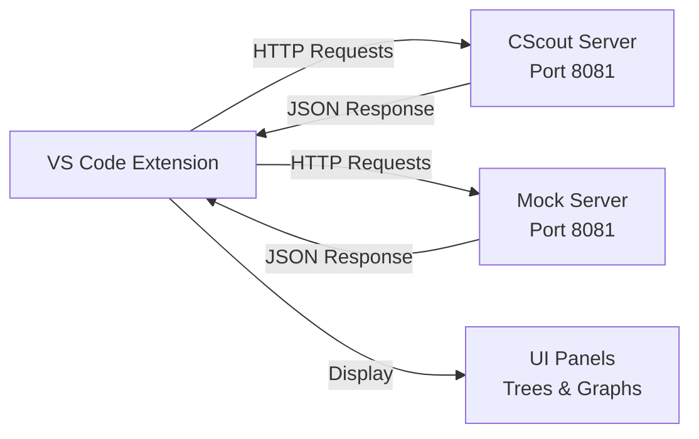
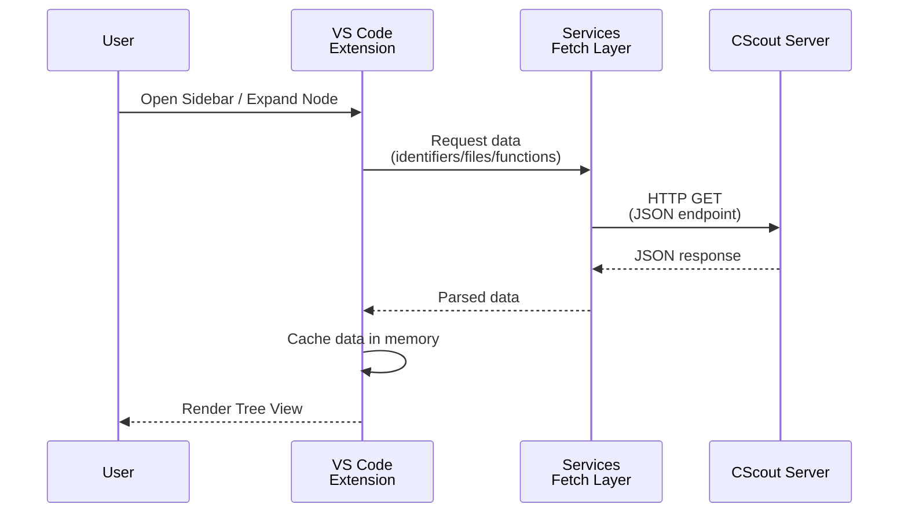
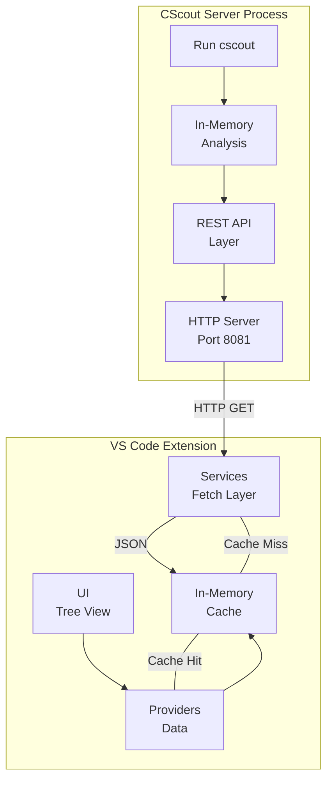
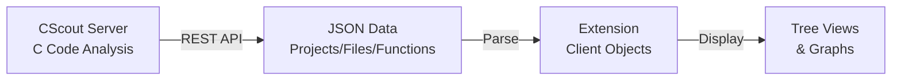

# CScout Lens - Simple Architecture

## Architecture

## Execution Flow

## CScout Process Architecture

## Data Model

## Key Endpoints Used

| Endpoint | Purpose |
|----------|---------|
| GET /api/projects | Get project info |
| GET /api/files | Get all files |
| GET /api/functions | Get all functions |
| GET /api/identifiers | Get all symbols |
| GET /api/funlist?f=FID | Get callers/callees |
| GET /api/filemetrics?id=N | Get file metrics |

